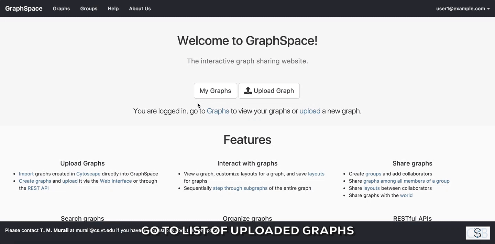

# Quick Tour of Cytoscape

## Welcome Screen

The [welcome page](http://graphspace.org) greets a user when the user visits GraphSpace. The Welcome Screen is designed to access commonly used features of GraphSpace like:

- Log In
- Create Account
- Upload a graph
- List of uploaded graphs.

### Log In

The user can log-in to [GraphSpace](http://www.graphspace.org) by following the given steps:

1. Click on the `Log In` button on the top navigation bar. This will trigger a log-in window/pop-up to be displayed.
2. Enter your email address. 
3. Enter you password.
4. Click on `Submit` button to log in with the given email address.
5. If you have forgotten you password, click on the `Forgot Password` link.

### Create Account

The user can create an account on [GraphSpace](http://www.graphspace.org) by following the given steps:

1. Click on the `Create Account` button on the top navigation bar. This will trigger a create account window/pop-up to be displayed.
2. Enter the your email address. 
3. Enter a password for your account.
4. Verify your password by entering the same password again.
5. Click on `Submit` button to create the account with the given email address and password.

### Upload a graph

The user can upload a graph on [GraphSpace](http://www.graphspace.org) by following the given steps:

1. Go to the [Upload Graph Page](http://www.graphspace.org/upload) by clicking on the `Upload Graph` button on [Home Page](http://www.graphspace.org/).
2. Enter a unique name for the new graph.
3. Select a CYJS file which contains the graph information.
4. Select a JSON file which contains the style information for the graph. (Optional Step)
5. Click on `Submit` button to upload the graph using the selected files.
6. Once the graph has been uploaded, [GraphSpace](http://www.graphspace.org) will provide a unique URL through which the user may interact with the graph represented by the uploaded files.

### List of uploaded graphs

The user can go to [a page that lists the graphs](http://www.graphspace.org/graphs/) accessible by the user on [GraphSpace](http://www.graphspace.org) by following the given steps:

- Click on the button titled `Graphs` on the top navigation bar.
 
     OR

- Click on the `My Graphs` button on the [Home Page](http://www.graphspace.org/).

In this example, the user owns 33 graphs, can access 64 public graphs and 33 graphs are shared with this user.

## Searching within Multiple Graphs

The user can search for graph with a given name or node or an edge on [Graphs Page](http://www.graphspace.org/graphs/) by following the given steps:

1. Enter the name of the graph, node or an edge you are searching for in the search bar.
2. Press `Enter` key or click on the `Search` button.

In this example, the user searches for the list for graphs that contain the protein (node) `CTNNB1` (the symbol for β-catenin, a transcriptional regulator in the Wnt signaling pathway). The reduced list of graphs are the graphs where proteins names/labels (nodes) contain `CTNNB1` as a substring. In the following example, There are six graphs owned by the user and thirty-two public graphs that contain this protein. Each link in the `Graph Name` column will take the user to a specific graph with the search term highlighted. In this example, the user clicks on the graph with the name `KEGG-Wnt-signaling-pathway` and reaches the graph for the Wnt pathway with the searched node highlighted.

## Searching within a Single Graph

The user can search for node or edges within a given graph on [GraphSpace](http://www.graphspace.org/) by following the given steps:

1. Enter the name of the node or an edge you are searching for in the search bar.
2. The nodes or edges are highlighted automatically as you type in the name of the node or edge in the search bar.

In this example, the user searches for the graph for two proteins (nodes) `CTNNB1` and `WNT` using the query `ctnnb1, wnt`. This search query highlights the proteins where protein (node) name/label contains `CTNNB1` or `WNT` as a substring (case-insensitive). In the following example, the graph contains four nodes which match the given query.

In example, the user searches for the graph for edges from `Wnt` to `Fzd` using the query `Wnt:Fzd`. This search query highlights any protein-protien interaction (edge) where tail node name or label contains `Wnt` as a substring and head node name or label contains `Fzd` as a substring. In the following example, the graph contains three edges which match the given query.

## Interacting with a Graph

TBD
