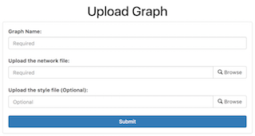

# Uploading Graphs

GraphSpace provides 2 different ways to upload graphs: 

- Via the REST API 
- Via the Web Interface

## Via the REST API

GraphSpace users can also upload graphs using GraphSpace's REST API. Please refer to the Programmer's Guide for more information.

## Via the Web Interface

As an alternative to the REST API for uploading a graph, we provide a [simple web interface](#upload-graph-form) for uploading individual graphs. Once the graph has been uploaded, GraphSpace will provide a unique URL through which the user may interact with the graph represented by the uploaded graph files.

If a user has an account and is logged in, [this interface](#upload-graph-form) will upload the graph directly into the user's account, much like using the REST API. If a user does not have an account or is not logged in, this upload functionality will provide a unique URL through which the user may interact with the graph represented by the uploaded file. **Note: After 30 days, we will delete all graphs that are uploaded for unregistered users of GraphSpace.**


### Upload Graph Form

<a href="#graph-upload-form">

</a>

The upload graph form has three input fields:

#### Graph Name 

The name of the graph. GraphSpace allows users to search graphs by their name. It is a required field. 

#### Network File 

The network file containing the graphs structure and data information in [CYJS Format](#cyjs-format). It is a required field.

##### CYJS Format

GraphSpace only supports one of the Cytoscape.js supported JSON formats, which is:

```
{
    elements:{
        nodes:[],
        edges:[]
    }
}
```

This [JSON (JavaScript Object Notation)](http://www.json.org/) format is defined by Cytoscape for storing network structure and data information. A Cytoscape (v3.1 or later) user can easily [export their graph](http://manual.cytoscape.org/en/stable/Cytoscape.js_and_Cytoscape.html#export-network-and-table-to-cytoscape-js) in above mentioned JSON format. We call the format as `CYJS` format because the extension of the exportable JSON file from Cytoscape App is `.cyjs`.

#### Style File 

The network file containing the graphs style information in [JSON Format](#stylesheet-json). It is a optional field. If left empty, GraphSpace will use [default style](#default-graph-style) for displaying the graphs.

##### Stylesheet JSON

Cytoscape and Cytoscape.js are sharing a concept called [Style](http://manual.cytoscape.org/en/stable/Cytoscape.js_and_Cytoscape.html#export-styles-to-cytoscape-js). This is a collection of mappings from data point to network property. Cytoscape can export its Styles into CSS-based Cytoscape.js JSON. 

A Cytoscape (v3.1 or later) user can export all Styles into one JSON file from **File | Export | Style** and select Cytoscape.js JSON as its format.

**Note:** Cytoscape.js [does not support all of Cytoscape Network Properties](
http://manual.cytoscape.org/en/stable/Cytoscape.js_and_Cytoscape.html#limitations). Those properties will be ignored or simplified when you export to JSON Style file.

##### Default Graph Style

GraphSpace uses following default style for all graphs. The default style values are used when:

- The user does not upload a [style file](#style-file) for the graph.
    OR
- The user uploads the style file which doesn't overrides the default style values.

```
[
    {
        'selector': 'edge',
        'style': {
            'curve-style': 'bezier',
            'line-style': 'solid',
            'line-color': 'black'
        }
    },
    {
        'selector': 'node',
        'style': {
            'content': 'data(label)',
            'shape': 'ellipse',
            'background-color': 'yellow',
            'border-color': '#888',
            'text-halign': 'center',
            'text-valign': 'center'
        }
    }
]
```

