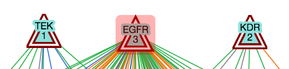

# Viewing Graphs

When viewing a graph, you will notice several tabs above the graph. Clicking on a tab link will reveal the tab. The Graph Page has following 5 tabs:

- Graph Visualization Tab
- Graph Information Tab
- Edges Tab
- Nodes Tab
- Layouts Tab

## Graph Visualization Tab

The Graph Visualization Tab has two sections:
- Left section shows the actual graph.
- Right section shows multiple interaction options.

### Node and Edge Popups

Each node or edge in a graph may have information embedded in it via the popup attribute. Clicking on a node or edge will highlight them. If the clicked node/edge contains popup attribute (see JSON reference), popup attribute's value will appear in a pop-up box; otherwise, no popup will be shown. If the popup attribute's value is formatted in HTML, GraphSpace will interpret it appropriately else it will use it as free-text information. 

The image below shows an example of the popup shown for a node JAK2. 

### Highlighted Graph Elements

EGFR before highlighting             |  EGFR after highlighting 
:-------------------------:|:-------------------------:
  |  

## Graph Information Tab

## Edges Tab

## Nodes Tab

## Layouts Tab
